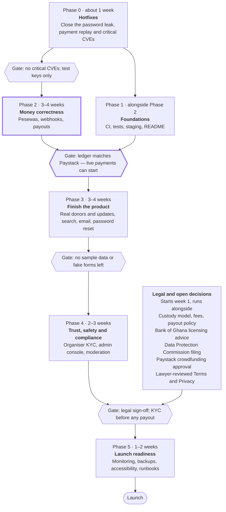

# FlowFund Production Roadmap

_As of 2026-10-03; Phase 0 and Phase 1 status updated 2026-10-04_

FlowFund is a working prototype, not yet safe for real money. Donations can be replayed to inflate totals, every event page sends the organiser's password hash to the browser, and withdrawals are not built on main. Two developers need roughly 10–14 weeks to reach a production launch. Phase 0 (about one week) must ship before any live payment is taken.

## At a glance

Phase 1 and the legal track run alongside the main line. The Phase 2 gate is the earliest point to switch Paystack to live keys.

## Where it stands

The stack is Next.js 15 (App Router), Prisma on MySQL, NextAuth v4, Paystack and Cloudinary. About a third of the screens are real; the rest are UI shells with sample data or fake submit handlers.

| Area | State | What's true today |
| --- | --- | --- |
| Sign up / sign in (email, Google) | Works | No email verification. Password rules exist only in the browser. |
| Create event + fundraiser | Works | Fixed in Phase 1: event and fundraiser are now one write, and images are checked on the server. |
| Edit event | Works, risky | Target and minimum can change after donations. Reuses the create schema, so an event whose date has passed can no longer be edited. |
| Donate (Paystack inline) | Works, unsafe | See Critical issues. Fundraiser end date and minimum amount are not enforced. Donor count never increments. |
| Dashboard | Works | Donations are matched by the email typed at checkout. Shows $ in some places and GH₵ in others. |
| Event page | Partial | Donors and Updates tabs show hard-coded sample data. Share button does nothing. |
| Discover page | Partial | Search, category filter, sort and goal range are decorative. No pagination. |
| Home page | Partial | "Featured" loads every event in the database. |
| Donation success page | Partial | Says a receipt was emailed; none is sent. Amount and title come from the URL. |
| Delete event | Broken | API route reads `params` without awaiting it and the fundraiser foreign key has no cascade. `delete-event-button.tsx` is empty. |
| Withdraw funds | Broken on main | Page calls `/api/withdrawals`, which exists only on the unmerged `origin/event` branch. It also misreads the event API response shape. |
| Forgot password, Profile, Contact | Stub | Submit handlers are `setTimeout` + `alert`. Profile shows "New York, USA" for everyone. |
| Email (receipts, alerts, resets) | Missing | No email provider is wired up. |
| Admin / moderation / organiser verification | Missing | Anyone can create a campaign and request payouts. |
| Tests, CI, README, `.env.example` | Done (Phase 1) | Unit, integration and end-to-end tests run in GitHub Actions. Staging is not set up yet. |

The `origin/event` branch is two commits ahead of main (last touched July 2025): a console.log cleanup and a mock withdrawal API. Merge the cleanup; rewrite the withdrawal API rather than merging it (see Critical issues).

## Critical issues

Seven problems make the app unsafe to run with real money or real users. Items 2 and 3 together allow a direct theft path: inflate a campaign's total by replaying one payment, then withdraw money that other campaigns' donors paid in.

| # | Issue | Where | Fix |
| --- | --- | --- | --- |
| 1 | **Password hash sent to every visitor.** The event page loads the organiser's full `User` row and passes it to the client `DonationForm`, so the bcrypt hash and email are serialised into the page. | `app/events/[id]/page.tsx:36`, `components/donation-form.tsx` | Select only `id` and `name`. Add a global Prisma `omit: { user: { password: true } }`. Never pass raw Prisma rows to client components. |
| 2 | **Donations can be replayed.** `/api/donations/verify` accepts any successful Paystack reference, any number of times, for any `fundraiserId` the client sends. Each call adds to `raisedAmount`. | `app/api/donations/verify/route.ts` | Unique `reference` column, check the fundraiser and currency in Paystack metadata, wrap in a transaction, move to webhooks (Phase 2). |
| 3 | **Unmerged withdrawal API marks failed transfers as COMPLETED.** The transfer status check is commented out, the balance check has no lock (two concurrent requests both pass), and mobile money is sent with the bank `ghipss` type. | `origin/event: app/api/withdrawals/route.ts` | Do not merge. Rewrite in Phase 2. |
| 4 | **Known critical vulnerabilities in dependencies.** `npm audit` flags Next.js 15.2.4 (including RCE in the React flight protocol, GHSA-9qr9-h5gf-34mp), `@auth/core`, `cloudinary` <2.7, and `@rvf/set-get` (prototype pollution via form data, pulled in by `zod-form-data`, which parses the event create/edit forms). | `package.json` | Upgrade Next.js, React, next-auth, cloudinary; replace or update `zod-form-data`. |
| 5 | **Signup returns the stored password hash.** | `app/api/auth/signup/route.ts:34` | Return `{ id, email, name }` only. |
| 6 | **Build hides errors.** `ignoreBuildErrors` and `ignoreDuringBuilds` are on; `app/auth.ts` imports an export that doesn't exist and still ships. | `next.config.mjs` | Turn both off; fix the two TypeScript errors (`app/auth.ts`, `components/ui/calendar.tsx`). |
| 7 | **No rate limiting** on sign-in, signup or payment verification. | All API routes | Add per-IP and per-account limits. |

Dependency findings are from `npm audit --omit=dev` run on a clean install on 2026-10-03; the TypeScript check found exactly two errors.

## What needs to change

Beyond the bugs, several design choices will not hold up in production. These are the structural changes the phases below implement.

| Area | Today | Change to |
| --- | --- | --- |
| Money type | `Float` (migration `20250720150859` converted from Decimal) | Integer pesewas (`Int`/`BigInt`) everywhere; one `formatGHS()` helper using `Intl.NumberFormat`. |
| Source of truth for payments | Browser calls `/verify` after the Paystack popup; client generates the reference (`donation_${Date.now()}`) | Server initialises the transaction with its own reference and fundraiser metadata. A signed Paystack webhook records the donation. |
| Totals | `raisedAmount`, `donorCount`, `totalWithdrawn` mutated in separate, non-atomic writes | Donation and Withdrawal rows are the ledger. Counters update in the same transaction. A nightly job reconciles against Paystack. |
| Custody | All donations pool in one Paystack balance; payouts are transfers out of it | Decide: keep custodial with holds and KYC, or use Paystack subaccounts so funds settle directly to verified organisers (see Open decisions). |
| Payouts | Recorded as COMPLETED immediately | `PENDING → PROCESSING → COMPLETED / FAILED / REVERSED`, driven by transfer webhooks. Saved, verified payout accounts per user. |
| Deletion | Hard delete; fails on FK; would destroy financial records if it worked | Event status (`DRAFT`, `ACTIVE`, `ENDED`, `SUSPENDED`). Archive campaigns with donations; never delete money rows. Explicit `onDelete` rules. |
| Donor identity | Matched by typed email; anonymity is a fundraiser setting the form ignores | Optional `Donation.userId` when signed in; `isAnonymous` per donation. Store only needed Paystack fields, not the whole payload. |
| Validation | `createEventSchema` used for both create and edit; client checks differ from server (sign-in min 6 chars, sign-up min 8) | Shared zod schemas for client and server, separate create/update schemas, react-hook-form on the client. Zod errors return 400, not 500. |
| Route handlers | Prisma, Paystack and Cloudinary calls inline in each route | A `lib/services` layer with typed errors and one JSON error shape. Routes and server components stay thin. |
| Auth plumbing | Two auth helpers (`lib/auth.ts`, broken `app/auth.ts`), two bcrypt libraries, no middleware | One helper, one library, `middleware.ts` guarding `/dashboard`, `/events/create`, edit and withdraw routes. |
| Images | Public ID parsed back out of the URL; edit path builds `event-images/event-images/<uuid>`, so old images are never deleted; `images.unoptimized: true` | Store Cloudinary `public_id` and `secure_url`. Validate type and size on the server. Use `next/image` with a Cloudinary loader. |
| Repo hygiene | Package named `my-v0-project`; UI says FundFlow, repo says FlowFund; unused deps (`mysql2`, `@prisma/extension-accelerate`, `cloudinary-build-url`, `next-cloudinary`); duplicate `globals.css`, `use-toast`, `use-mobile`; 96-byte stub `pnpm-lock.yaml`; several deps pinned to `latest` | One name, one lockfile, pinned versions, duplicates and dead files removed. `alert()` replaced with toasts; stray `console.log`s removed (the header logs the session on every render). |

## Phase 0 — Hotfixes (about 1 week)

Gate: no critical `npm audit` findings and Critical issues 1, 2, 5, 6 and 7 closed. Keep Paystack on test keys until Phase 2 is done.

Status: code done and merged to `main`; two manual items remain (secret rotation, closing the mock withdrawal commit).

- [x] Event page selects only the organiser's `id` and `name`; add a global Prisma `omit` for `password`
- [x] Signup returns `{ id, email, name }`; validate email and password policy on the server with zod
- [x] Upgrade `next` (15.5.27), `react`, `next-auth`, `cloudinary`; patched `@rvf/set-get` under `zod-form-data` 2.x; `@auth/core` overridden to 0.41.3; removed unused `mysql2`. No critical findings left; 7 high + 1 moderate remain in build-time tooling (Tailwind 3's file watcher, the PostCSS bundled in Next 15), cleared by Next 16 / Tailwind 4 in Phase 1
- [x] Donation verify: unique `reference` column (migration backfills existing rows; replayed duplicates keep NULL for review), reject reuse, check fundraiser ID and `GHS` currency from Paystack metadata, single transaction with the fundraiser row locked first, deadlock retry, increment `donorCount` once per donor per fundraiser
- [ ] ~~Enforce minimum amount on the server~~ — moved to Phase 2: rejecting after Paystack has captured the money would lose the record. The form now enforces the minimum; the server logs below-minimum payments
- [x] Remove `ignoreBuildErrors` and `ignoreDuringBuilds`; fix the TypeScript errors (including a Next 15 `searchParams` type the build had been hiding); delete `app/auth.ts`
- [x] Fix `DELETE /api/events/[id]`: await `params`, refuse when donations exist, delete fundraiser and event in one transaction
- [x] Rate-limit sign-in (20/IP and 10/email per 15 min), signup (5/IP per hour) and verify (30/IP per 10 min). In-memory per instance; move to a shared store (e.g. Upstash Redis) once hosting is decided
- [ ] Rotate any secrets that have been shared outside a secrets manager — manual
- [x] Commit a `.env.example`
- [x] Bring over the console.log cleanup commit from `origin/event`
- [ ] Close the mock withdrawal commit on `origin/event` — manual

## Phase 1 — Engineering foundations (1–2 weeks, alongside Phase 2)

Gate: every PR runs typecheck, lint, tests and build in CI, and a staging environment mirrors production.

Status: code done on `main` (2026-10-04). Left: branch protection (a GitHub setting), staging (waits on the hosting decision), the product name, and the Next 16 / Tailwind 4 upgrade.

- [x] README covering setup, env vars, migrations and Paystack test mode
- [x] Add `"postinstall": "prisma generate"`; the generated client is gitignored, so a fresh deploy fails without it
- [x] One package manager and lockfile (npm); pin every `latest` dependency; remove unused deps (including the shadcn components that were the only users of recharts, embla, vaul, cmdk, input-otp and react-resizable-panels) and duplicate files; one bcrypt library (`bcryptjs`)
- [x] ESLint (flat config, run as `eslint .`) and Prettier configs; lint errors fixed; `.gitattributes` keeps LF endings
- [x] Validate env vars at boot with zod (`lib/env.ts`, loaded from `instrumentation.ts`)
- [x] Vitest: unit tests, plus integration tests of the services against real MySQL (replay, concurrency, ownership, deletion rules). Playwright: sign up → sign in → create event → dashboard, plus a check that visitors never receive the organiser's email or hash
- [ ] Playwright donate (Paystack test) → withdraw — waits on Phase 2's server-initialised transactions, webhook and withdrawal API
- [x] GitHub Actions: typecheck, lint, format, unit tests, migration drift check, integration tests, build and end-to-end tests
- [ ] Branch protection on `main` requiring the three CI jobs — GitHub → Settings → Branches (needs a repo admin)
- [x] Introduce `lib/services` and a shared error type (`AppError`, one `{ message, code, issues? }` response shape); zod failures return 400. Pages still query Prisma directly; move those reads as Phase 3 rewrites each page
- [ ] Staging environment with its own database and Paystack test keys — waits on the hosting decision
- [ ] Settle the product name and rename the package
- [ ] Upgrade to Next 16 and Tailwind 4 to clear the remaining build-time `npm audit` findings (7 high, 1 moderate). Next 16 drops `next lint` (already replaced) and renames `middleware.ts` to `proxy.ts`

Found and fixed along the way:

- Six old migrations used lowercase table names (`user`, `fundraiser`), which only work on case-insensitive MySQL (Windows/macOS). `prisma migrate deploy` failed on Linux at the second migration, so production could not have been created from them. Local databases made before the fix must be reset (see README)
- Creating an event without opening the category dropdown always failed: the default value matched no option
- Sign-up and sign-in forms submitted before hydration sent the password in the URL; they now POST
- Event images: server-side type and 5MB size checks; the new image is uploaded before the old one is deleted; edits no longer orphan old images; event and fundraiser are created in one write

## Phase 2 — Money correctness (3–4 weeks)

Gate: on staging, the ledger reconciles to Paystack to the pesewa, and concurrent donation and withdrawal tests cannot double-count or overdraw.

Open decisions settled (2026-10-07): custodial balance with transfers out (not subaccounts); a currency column now, defaulting to GHS; platform fee 5% of the money raised; payouts only after the fundraiser's end date.

- [x] Migrate all amounts from `Float` to integer pesewas, with a data migration for existing rows (migration `20261007120000_money_in_pesewas`; added a `currency` column, default GHS; `lib/money.ts` is the only GHS↔pesewas boundary)
- [x] Server-side `transaction/initialize` with a server-generated reference; metadata carries fundraiser ID, donor details and anonymity (`POST /api/donations/initialize`; the browser resumes the popup with the returned access code and no longer picks the amount, fundraiser or reference)
- [x] Paystack webhook route: verify the `x-paystack-signature` HMAC-SHA512, process idempotently, treat `charge.success` as the source of truth (`POST /api/webhooks/paystack`; the client `/verify` call and the webhook share one idempotent recorder keyed by the unique reference)
- [x] At donation time, require the fundraiser to be active, before its end date, and at or above its minimum (enforced in `initializeDonation`, before any money is captured)
- [x] Payout accounts: users add a bank or mobile money account, verified with Paystack account resolution; store the `recipient_code` once with the correct recipient type (`PayoutAccount` model; `BANK_ACCOUNT`→`ghipss`, `MOBILE_MONEY`→`mobile_money`; `POST /api/payout-accounts`)
- [x] Rewrite withdrawals: balance check and debit inside one transaction with a row lock (`SELECT … FOR UPDATE`), status starts `PENDING`, finalised by `transfer.success` / `transfer.failed` / `transfer.reversed` webhooks (`requestWithdrawal` reserves funds under the lock, then sends the transfer; `finalizeTransfer` settles idempotently and releases funds on failure/reversal; status lifecycle `PENDING → PROCESSING → COMPLETED / FAILED / REVERSED`)
- [x] Fee model: "available" means net of fees. Platform fee is 5% of the money raised (`lib/fees.ts`); `availableToWithdraw = raised − 5% − totalWithdrawn`, enforced in `requestWithdrawal` and shown on the withdraw page. Payout policy: withdrawals are allowed only after the fundraiser's end date. (Showing per-transaction Paystack fees is a smaller follow-up.)
- [ ] Admin-initiated refunds and chargeback handling — waits on the admin console (Phase 4); the webhook and audit log are in place to build on
- [x] Nightly reconciliation against Paystack transactions and transfers, with an alert on any drift — the comparison logic is done (`lib/services/reconciliation.ts`: counters vs the ledger, each donation and withdrawal vs Paystack to the pesewa; drift is logged and written to the audit log). Triggered by `POST /api/cron/reconcile` behind `CRON_SECRET`, so any scheduler can run it; **which** scheduler (and real alerting, Phase 5) waits on the **hosting** decision
- [x] Append-only audit log for every money movement and admin action (`AuditLog` model; donation recording and every withdrawal state change write an entry inside the same transaction as the balance move, so the log can never disagree with the balances)

## Phase 3 — Finish the product (3–4 weeks)

Gate: no screen shows sample data or a fake submit handler.

- [x] Donors tab from real donations, respecting anonymity, paginated (`listDonors` + `GET /api/events/[id]/donors`; anonymous gifts show as "Anonymous" and the email is never exposed; `Donation.userId`/`isAnonymous` added, captured from the session at initialise)
- [x] Campaign updates: an `Update` model, organiser posting UI, list on the event page (the Updates tab lists real posts; the organiser sees a post form; `GET/POST /api/events/[id]/updates`, owner-only create/delete)
- [x] Discover page: search, category, sort and goal range driven by URL search params, with pagination (`searchEvents` + `parseDiscoverParams`/`buildDiscoverWhere`; a `DiscoverFilters` client component writes the filters to the URL so results are shareable and server-rendered; 9 per page)
- [x] Home page "featured" limited and curated instead of loading every event (`featuredEvents` returns the few most active current campaigns)
- [x] Share button (Web Share API with copy-link fallback); per-event `generateMetadata` and Open Graph image (`ShareButton` component; the event page sets title/description/OG/Twitter tags from the event and its image)
- [x] Close / archive campaign UI (replace the empty `delete-event-button.tsx`) — `DeleteEventButton` confirms and deletes an event with no donations; one with donations is refused by the API with a clear message. A full archive/status lifecycle (`DRAFT/ACTIVE/ENDED/SUSPENDED`) is Phase 4.
- [x] Profile page that saves: name, avatar upload, password change (`/api/profile`, `/api/profile/avatar`, `/api/profile/password`; the page loads the real user and only a hasPassword boolean reaches the client; an OAuth-only account can set a first password)
- [x] Email verification and a real password reset using the existing `VerificationToken` table (sign-up emails a confirmation link; `GET /api/auth/verify-email` marks the address verified; password reset done)
- [x] Transactional email (Resend over its HTTP API, swappable; logs when unconfigured): donation receipt, new-donation alert, payout status, password reset and email verification — the money-path sends are best-effort and never break the transaction
- [x] Contact form that sends email (`POST /api/contact` → `CONTACT_TO`/`EMAIL_FROM`; the page submits for real instead of a `setTimeout`)
- [x] Dashboard "My donations" linked by `userId` when signed in (no longer matched by the email typed at checkout)
- [x] Edit rules: lock target and minimum after the first donation; allow editing events whose date has passed (`updateEventSchema` permits past dates; `updateEvent` refuses a changed target/minimum once a donation exists)
- [x] Toasts instead of `alert()`; `error.tsx`, `not-found.tsx` and loading states (sonner `Toaster` mounted; every `alert()` replaced with a toast; root `error.tsx` and `not-found.tsx` added; `events/loading.tsx` already present). react-hook-form migration is still outstanding — forms validate against the shared zod schemas on the server today.
- [x] GH₵ everywhere via one formatter (`formatMoney`/`formatGHS`; no screen shows `$`)

## Phase 4 — Trust, safety and compliance (2–3 weeks of engineering; start the legal work now)

Gate: written legal sign-off on the operating model, and no payout possible to an unverified organiser.

- [ ] Organiser verification before the first payout: ID, phone, and payout account name matching the verified name
- [ ] Admin console: review and suspend campaigns, approve payouts above a threshold, issue refunds, ban users
- [ ] Report-a-campaign flow and basic moderation of titles, descriptions and images
- [ ] Campaign lifecycle: `DRAFT → PENDING_REVIEW → ACTIVE → ENDED / SUSPENDED`
- [ ] Lawyer-reviewed Terms, Privacy Policy and refund policy (current pages are template text dated May 2023)
- [ ] Confirm with counsel whether holding and disbursing donor funds needs a Bank of Ghana licence or a licensed partner (Payment Systems and Services Act, 2019, Act 987), and register with the Data Protection Commission (Data Protection Act, 2012, Act 843)
- [ ] Confirm Paystack approves crowdfunding on the merchant account (the withdrawal code already notes the account must be upgraded to a registered business)
- [ ] Data retention and account deletion; keep only the Paystack fields needed
- [ ] Security headers (CSP, HSTS); external security review of the payment and payout paths

## Phase 5 — Launch readiness (1–2 weeks)

Gate: a rehearsed release with backups restored once, alerts firing to a person, and runbooks written.

- [ ] Error tracking (Sentry) and structured logs; uptime checks; alerts on webhook failures and reconciliation drift
- [ ] Managed MySQL with automated backups and one tested restore; `prisma migrate deploy` in the release pipeline
- [ ] Performance: `next/image` with Cloudinary transforms, database indexes (`fundraiserId`, `donorEmail`, `reference`, `userId`), caching for the Discover page
- [ ] Accessibility: the amount picker and anonymity toggle are clickable `div`s that keyboards cannot reach; labels and contrast pass
- [ ] SEO: sitemap, robots, page metadata
- [ ] Product analytics and a view → donate funnel
- [ ] Runbooks for failed payouts, webhook backlog, refunds and incidents
- [ ] Load test the donate and webhook paths

## Open decisions

These change the scope of Phases 2 and 4, so settle them before Phase 2 starts.

- [ ] **Custody model.** Keep funds in the platform's Paystack balance and pay out by transfer, or use Paystack subaccounts so donations settle straight to verified organisers? Subaccounts shrink regulatory exposure and the withdrawal feature; custodial gives more control over holds and refunds.
- [ ] **Platform fee.** Percentage, and whether donors add it on top or organisers absorb it.
- [ ] **Payout policy.** Withdraw any time, only after the end date, or only after verification? Minimum payout amount?
- [ ] **Currencies.** GHS only, or other Paystack markets (NGN, KES, ZAR) later? This decides whether currency is a column now.
- [ ] **Name.** FundFlow (the UI) or FlowFund (the repo)?
- [ ] **Hosting.** Vercel plus a managed MySQL provider, or a single VPS / container host? This affects how webhooks, cron reconciliation and backups are run.
